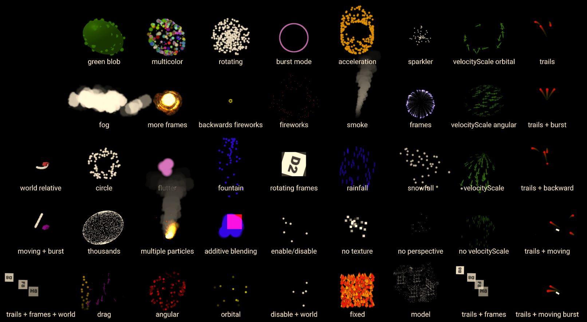

# aframe-sprite-particles-component

The **sprite-particles** component uses shader based points geometry to create a set of particles from texture billboards (camera facing textures).  The particles start spawning once the component is created, and will continue until the **duration** expires. Properties can be used to define the position, velocity, acceleration, color, scale and rotation of the particles.

For a demo goto https://harlyq.github.io/aframe-sprite-particles-component/



## Examples
```html
<head>
  <script src="https://aframe.io/releases/0.8.2/aframe.min.js"></script>
  <script src="https://unpkg.com/aframe-sprite-particles-component@^0.1.0/aframe-sprite-particles-component.js"></script>
</head>
<body>
  <a-scene>
    <a-gltf-model id="model" texture="assets/blob.png" scale="0.5 0.5 0.5" visible="false"></a-gltf-model>
    <a-entity position="0 5 -5" sprite-particles="texture: assets/blob.png; velocity: .1 1 .1; acceleration: 0 -1 0..0 -2 0; color: red,yellow"></a-entity>
    <a-entity position="0 0 -5" sprite-particles="radialSpeed: 1..2; color: red"></a-entity>
  </a-scene>
</body>
```

## Values
Some of the properties are listed as type (*range*), which is either a minimum and maximum value separated by `..` (the system will chose a value within that range for each particle) or just a single value.

Some properties are listed as type (*range array*). This provides different values over the life-time of the particle.  The first value is for when the particle is created, linearly interpolating over values, until the last value is reached at the end of the particle's life.  By default there are a maximum of 5 elements for each over-time array, but this can be changed in the **overTimeSlots** parameter. Each element of the array is of type (*range*) so it may be either a single value or a min and max value separated by `..`

For example:

`lifeTime: 1` all particles have a life time of 1 (number range)

`lifeTime: 2..4` all particles have a life time between 2 and 4 inclusive (number range)

`velocity: 1 1 .1 .. 2 3 5` velocity value between 1 and 2 for x, 1 and 3 for y, .1 and 5 for z (vec3 range)

`scale: 1..2,3,6,.5 .. 1,9` there are 5 values so each value represents 0%, 25%, 50%, 75% 100% of the particles life time. At 0% scale is between 1 and 2, then blend to 3 at 25%, then up to 6 at 50%, a value between .5 and 1 at 75%, then back up to 9 at 100% (number range[])

`rotation: 0,360` there are 2 values, each particle starts at 0 rotation, and linearly interpolates counterclockwise to 360 (rotation about the XY plane) over the lifetime of the particle (number range[])

## Properties
The list of properties in alphabetical order:

**acceleration** - range for acceleration of each particle in local coordinates (*vec3 range*) default 0 0 0

**alphaTest** - don't draw any pixels from the texture that fall below this alpha level. can be used to hide low alpha parts of the texture, but may leave artefacts around the edges of particles (*number*) default 0

**angularVelocity** - range for rotational velocity in degrees per second (counterclockwise) around the local origin. first element is about the X axis, second about Y and third for the Z axis (*vec3 range*) default 0 0 0

**blending** - control how the particles' color blends with the colors behind the particle system (*none, normal, additive, subtractive, multiply*) default normal

**color** - over-time ranges for the particle color. can use names e.g. `blue` or `color`, or hex strings e.g. `#ff0` or `#e7f890` (*color range array*) default white

**depthTest** - if true, particles will not be drawn if another object has been drawn previously in front of the particle (*boolean*) default true

**depthWrite** - if true, particle pixels will write their depth position to the depth buffer (obscuring objects that appear behind the particle, but were drawn after the particle system). if false, the particles do not affect the depth buffer, so objects drawn after the particle system, but located behind the particle system will be drawn on top (*boolean*) default false

**direction** - the direction to play the particle effect. if playing backward the particle will start at the end of its maximum age and then get younger (*forward, backward*) default forward

**duration** - no new particles will be generated after this time in seconds. if negative, particles are generated forever. changing the duration will restart the particle system (*number*) default -1

**enableInEditor** - if true, the particle system will run while the AFrame Inspector is active (*boolean*) default false

**fog** - if true, apply fog to all particles (*boolean*) default false

**lifeTime** - range for maximum age of each particle (*number range*) default 1

**position** - range for offseting the initial particle position in local coordinates (*vec3 range*) default 0 0 0

**opacity** - over-time ranges for the particle opacity. `0` is transparent, `1` is opaque (*number range array*) default 1

**overTimeSlots** - maximum number of slots for over-time attributes. if an attribute has more than **overTimeSlots** slots, then the remainder are ignored (cannot be changed at run-time) (*int*) default 5

**particleSize** - the size of each particle in pixels. if **usePerspective** is `true` then this is the size of the particle at 1m from the camera (*number*) default 100

**radialAcceleration** - range for an acceleration from the local origin (*number range*) default 0

**radialPosition** - range for offseting the start position from the local origin (*number range*) default 0

**radialType** - shape for radial parameters, either a circle in XY or a sphere (*circle, sphere*) default circle

**radialSpeed** - range for a radial speed from the local origin (*number range*) default 0

**relative** - if local, all particles move relative to the entity. if world, new particles are spawned at the current entity position, but spawned particles are not affected by the entities' movement (cannot be changed at run-time) (*world, local*) default local

**rotation** - over-time ranges for the particle rotation counterclockwise about the XY plane. all rotations are from min range to max range, and in degrees (*number range array*) default 0

**scale** - over-time ranges for the particle scale (scaled equally in all dimensions) (*number range array*) default 1

**seed** - initial seed for randomness. if negative, then there is no initial seed (*int*) default -1

**spawnRate** - number of particles emitted per second. if **spawnType** is `burst`, then **spawnRate * maximum(lifeTime)** particles are spawned on the first frame of each loop (*number*) default 10

**spawnType** - continuous particles are emitted at the spawn rate, whilst burst particles are all emitted once the spawner is activated, and are re-emitted once all particles expire (*continuous, burst*) default continous

**texture** - the texture for each particle. if no texture is defined, a white opaque square is used (*map*) default empty

**textureCount** - the number of frames in the **texture**. if 0, the number of frames is assumed to be **textureFrame.x * textureFrame.y** (*int*) default 0

**textureFrame** - the number of columns (x) and rows (y) for this texture (*vec2*) default 1 1

**textureLoop** - the number of times to loop the texture over the lifetime of the particle (*number*) default 1

**transparent** - set to true to make the alpha channel of the texture transparent (*boolean*) default true

**usePerspective** - if true, particles will become smaller the further they are from the camera (*boolean*) default true


## Limitations

Both radial and non-radial values are applied to each particle. So a particle's position will be the sum of the **position** and **radialPosition**, similarly for velocity and acceleration.

Using a **depthWrite** of `false` produces the best results for particles with transparency, but it may mean that objects that should be behind the particle system appear in front of the particle system (especially for large terrain objects which may be partially in-front and partially behind the particle system).  For these cases setting **depthWrite** to true will fix the draw problem, but you may start to see transparent parts of one particle obscuring other particles.  In this case the particles are being drawn at the same depth from the camera, but the first particle drawn is obscuring the other particles.  To fix the transparency problems, use the **alphaTest** value to ignore texture values below a certain alpha value (try a value of .5, if too much of the particle is being lost then decrease the value, or if there is still too much of the background of one particle obscuring other particles then increase the value).  Note that using a non-zero **alphaTest** may result in a thin edge appearing around some of the particles.

For a detailed explaination for depth testing and the depth buffer see https://learnopengl.com/Advanced-OpenGL/Depth-testing

When using **rotation** on textures with frames, parts of the adjacent frames will be visible during the rotation.  So it is important that there is a large buffer of empty space around the non-transparent parts of the frames, so that adjacent frames don't visibly leak into the particle during rotation.

The particle systems uses a cyclic pool of (**spawnRate * maximum(lifeTime)**) particles and particles that have expired are recycled to become new particles.  This impacts the draw order, because a new particle may actually be recycled from a much older particle and hence be drawn before the previous particle. Typically it is not a problem, but it may explain why a particle system appears different after the first loop.
